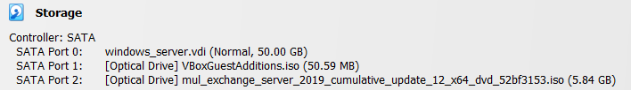
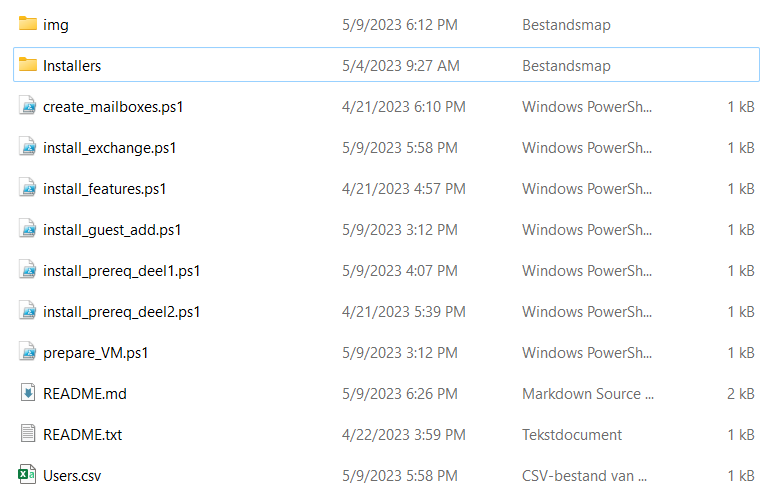

# Installatie van MS Exchange
## Op voorhand te installeren software
- VCredist: https://download.microsoft.com/download/2/E/6/2E61CFA4-993B-4DD4-91DA-3737CD5CD6E3/vcredist_x64.exe
- Rewrite: https://download.visualstudio.microsoft.com/download/pr/2d6bb6b2-226a-4baa-bdec-798822606ff1/8494001c276a4b96804cde7829c04d7f/ndp48-x86-x64-allos-enu.exe
- Ndp48: https://download.microsoft.com/download/1/2/8/128E2E22-C1B9-44A4-BE2A-5859ED1D4592/rewrite_amd64_en-US.msi

## Virtuele Machine Specificaties
- 4-6 Cores
- 10 GB Ram
- VBoxGuestAdditions iso op SATA Poort 1
- Exchange iso op SATA Poort 2

## Shared Folder (Belangrijk!!)
- Maak een mapje Installers aan in de directory van de scripts
- Plaats in dit mapje VCredits, Rewrite en Ndp48
- Share deze folder
- Zo ziet de folder er uit
  

## Stappen om te installeren
1. Voer volgende commando's uit
   - cd E:
   - .\VBoxWindowsAdditions.exe
   - Restart-Computer
2. Share de Sharedfolder met de VM 
3. Navigeer naar de sharedfolder (default: cd Z:)
4. Voer prepare_VM.ps1 uit, voer je wachtwoord van de lokale gebruiker in en daarna van een user in de Active Directory (best administrator) 
   - Herstart de vm (Restart-Computer)
5. Voer install_prereq_deel1.ps1 uit
   - Herstart de vm (Restart-Computer)
6. Voer install_features.ps1 uit
7. Voer install_prereq_deel2.ps1 uit
   - Herstart de vm (Restart-Computer)
8. Voer install_exchange.ps1 uit
   - Herstart de vm (Restart-Computer)
9. Typ LaunchEMS in de console (Dit opent de Exchange CLI)
10. Navigeer naar de Shared Folder en voer create_mailboxes.ps1 uit